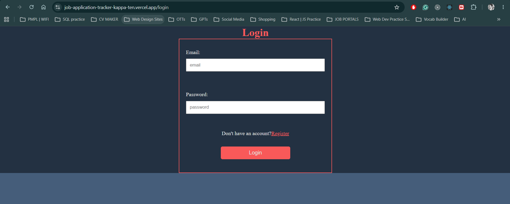
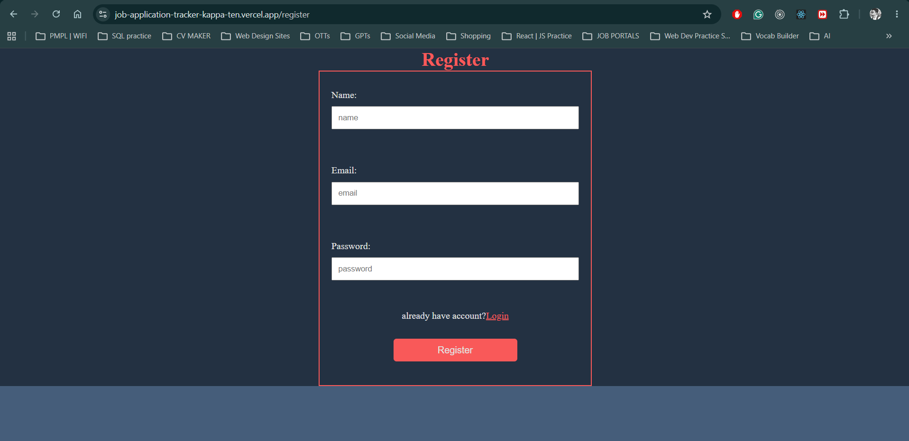
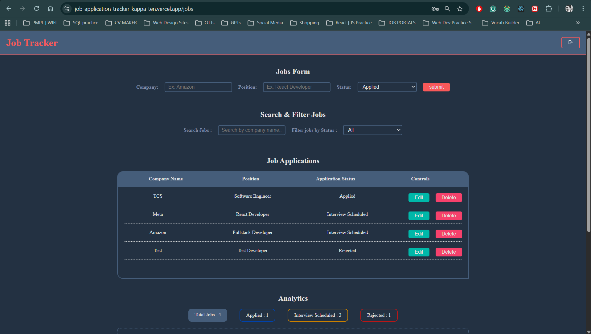
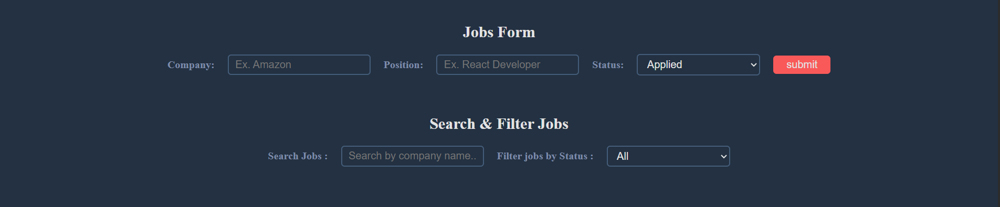
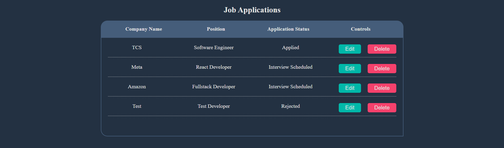
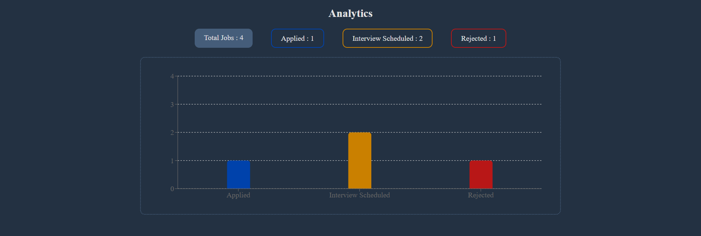

# 🚀 Job Application Tracker


A full-stack Job Application Tracker that helps users manage and track their job applications efficiently.

Users can register, log in securely, and keep track of their job applications with search and filtering capabilities.

---

## 🌐 Live Demo

### Frontend
https://job-application-tracker-kappa-ten.vercel.app

### Backend API
https://job-application-tracker-backend-fqx6.onrender.com

---

## 📸 Screenshots

### Login Page


### Register Page


### Jobs Page


#### Form, Search & Filter


#### Job Application Listing


#### Job Application Analytics

---

## ✨ Features

- User Registration
- User Login with JWT Authentication
- Protected Routes
- Add Job Applications
- Edit Existing Jobs
- Delete Jobs
- Search Jobs by Company
- Filter Jobs by Status
- Separate Data for Every User
- PostgreSQL Database
- Desktop UI
- Toast Notifications
- REST API Architecture
- Fully Deployed (Frontend + Backend)

---

## 🛠 Tech Stack

### Frontend

- React
- React Router
- Vite
- CSS
- React Hot Toast
- React Icons

### Backend

- Node.js
- Express.js
- PostgreSQL
- JWT Authentication
- bcrypt
- dotenv
- CORS

### Deployment

- Vercel (Frontend)
- Render (Backend)
- Neon PostgreSQL Database

---

## 📂 Project Structure

```
Job-Application-Tracker
│
├── frontend
│   ├── src
│   ├── public
│   └── package.json
│
├── backend
│   ├── middleware
│   ├── server.js
│   ├── db.js
│   └── package.json
│
└── README.md
```

---
## Authentication & Authorization Flow - 
### Registration
```
/register
    |
Validate name, email, password
    |
Check if email already exists
    |
    ├── Yes
    |      |
    |   Return 409 Conflict
    |
    └── No
           |
bcrypt.hash(password)
           |
Store name, email, hashed password
           |
Return 201 Created
```

### Login
```
/login
    |
Validate email, password
    |
Find user by email
    |
    ├── User not found
    |      |
    |   Return 401
    |
    └── User found
           |
Retrieve hashed password
           |
bcrypt.compare(password, hashedPassword)
           |
    ├── Invalid
    |      |
    |   Return 401
    |
    └── Valid
           |
jwt.sign({ id })
           |
Return accessToken
```

### Protected Route (/jobs)
```
/jobs
    |
Read Authorization Header
    |
Header starts with "Bearer "?
    |
Extract accessToken
    |
jwt.verify(accessToken)
    |
Get userId
    |
req.userId = userId
    |
SELECT * FROM jobs
WHERE user_id = req.userId
    |
Return jobs
```

## ⚙️ Installation

### 1. Clone the repository

```bash
git clone https://github.com/saptarsidebnath98/Job-Application-Tracker.git
```

### 2. Move inside the project

```bash
cd Job-Application-Tracker
```

---

## Frontend Setup

```bash
cd frontend
npm install
```

Create a `.env` file

```env
VITE_API_URL=http://localhost:5000
```

Run

```bash
npm run dev
```

---

## Backend Setup

```bash
cd backend
npm install
```

Create a `.env`

```env
PORT=5000

JWT_SECRET=your_secret_key

DATABASE_URL=your_postgresql_connection_string

FRONTEND_URL=http://localhost:5173
```

Run

```bash
npm start
```

---

## 🔐 Environment Variables

### Frontend

```env
VITE_API_URL=http://localhost:5000
```

### Backend

```env
PORT=5000

JWT_SECRET=your_secret_key

DATABASE_URL=your_postgresql_connection_string

FRONTEND_URL=http://localhost:5173
```

---

## 🔑 API Endpoints

### Authentication

| Method | Endpoint |
|---------|----------|
| POST | /register |
| POST | /login |

---

### Jobs

| Method | Endpoint |
|---------|----------|
| GET | /jobs |
| POST | /jobs |
| PUT | /jobs/:id |
| DELETE | /jobs/:id |

---

## 📌 Future Improvements

- Pagination
- Sorting
- Dashboard Charts
- Job Notes
- Interview Date
- Company Logo
- Dark Mode
- Email Verification
- Forgot Password
- Refresh Tokens
- Docker Support
- CI/CD Pipeline
- Unit Testing
- E2E Testing

---

## 🧠 What I Learned

- Building a complete MERN-style application
- JWT Authentication
- Protected Routes
- REST API Design
- PostgreSQL
- Migrating from MySQL to PostgreSQL
- Environment Variables
- Deployment using Render & Vercel
- Production Debugging
- CORS Configuration
- React Router Deployment Configuration

---

## 👨‍💻 Author

**Saptarsi Debnath**

GitHub:
https://github.com/saptarsidebnath98

LinkedIn:
https://www.linkedin.com/in/debnaths98/

---

## ⭐ If you like this project

Please consider giving it a ⭐ on GitHub.
